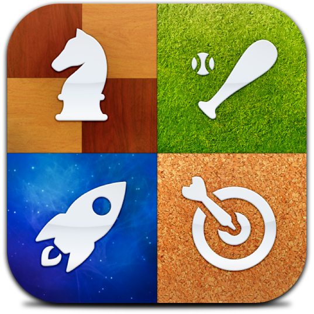

<h1>GameCenter discord Bot</h1>

GameCenter discord Bot, cumple las funciones dentro de discord desde el chat normal de discord que deja jugar online entre varios participantes distintos juegos


## FAQ

#### ¿Como puedo jugar?

Al dia de la fecha el bot se puede tanto correr desde la base o invitarlo al discord, una vez invitado se puede lanzar el comando desde cualquier chat.

#### ¿Que tipos de comandos hay?

Hasta la fecha Python Port-Scaffolder puede generar los siguientes tipos de proyectos

- &coinflip
- &flip cara / cruz
- &pregunta
- &higherlower       
- &hl 500           
- &altobajo 1000     
- &altobajo 50
- &reaccion

## Installation


Comandos para poder correr el codigo

```bash
  cd {carpeta con el codigo}

  pip install discordpy

  py/python bot.py
```

    
## Tech Stack

**Bot stack:** Python y discord.py
